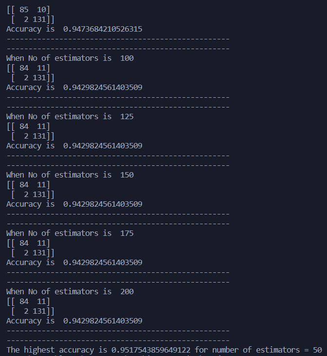

 This machine learning project composes of seven parts where I compared
    and optimized different classifiers such as KNN, decision tree, random forest,
    Naive Bayes and many more for Tumor database of Sklearn that you can find in the below link :    
    https://scikit-learn.org/stable/modules/generated/sklearn.datasets.load_breast_cancer.html

<h1>Part 1 - KNN</h1>
In the first part we optimized the K Nearest Neighbor when K =
3, 5, 7, 9, 11 and 13. The highest accuracy was printed for the best K optimization as shown below.

<h1>Part 2 - Decision Tree</h1>
In the second part we designed a Decision Tree Classifier and optimized its hyperparameter, depth with values of 3, 4, 5 and 6.

<h1>Part 3 - classifiers Comparison</h1>
In the third part we compared all the classifiers which are Nearest Neighbors, Linear and RBF SVM, Gaussian Process,Decision Tree,
Random Forest,Neural Net,AdaBoost,Naive Bayes and QDA. We plotted the final results as demosntrated below. We also printed the highest accuracy for the best model.

<h1>Part 4 - classifiers Scores</h1>
In this part we compared all classifiers using confusion matrix, accuracy, precision, recall, ROC, AUC and Complexity based on time.

<h1>Part 5 - Random Forest</h1>
In this part we designed and optimized a Random Forest classifier by tunning the hyperparameter number of estimators.

<h1>Part 6 - Ensemble classifier</h1>
In this part we designed an ensemble classifier to produce a better performance than the standalone classifiers. The standalone classifiers used were
Random Forest, KNN and Ada Boost.

<h1>Part 7 - User Input</h1>
Lastly, we developed a program to accept from the user the features and give the prediction for all the classifiers including the ensemble classifier
as shown below.

